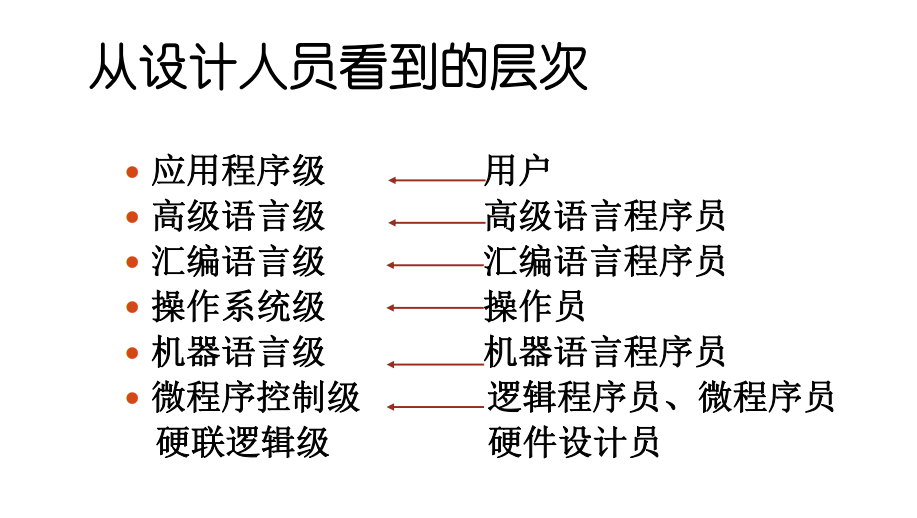

# CH1 计算机系统结构导论

翻译：先用转换程序将高一级机器级上的程序整个地变换成低一级机器级上等效的程序，然后再在低一级机器级上实现的技术。

解释：在低级机器级上用它的一串语句或指令来仿真高级机器级上的一条语句或指令的功能，是通过对高级的机器级语言程序中的每条语句或指令逐条解释来实现的技术。

**计算机系统结构、计算机组成、计算机实现所包含的内容（选择）；**

- 计算机系统结构包含：
	- 数据表示
		- 硬件能直接识别和处理的数据类型、格式
	- 寻址方式
		- 最小寻址单位，寻址方式的种类，地址的计算
	- 寄存器组织
		- 数据寄存器、变址、控制寄存器、专用寄存器等数量，使用方法
	- 指令系统
		- 指令的格式、类型，使用方法
	- 存储系统
		- 最小编址单位，编址方式，存储容量，最大存储空间
	- 中断系统
		- 中断类型，优先级别，入口地址的形成
	- I/O 接口的结构
		- I/O 的连接方式、访问方式、编址方式
	- 信息的保护
		- 保护方式，硬件对信息的保护和支持
	- 机器工作状态、定义和切换
- 计算机组成包含：
	- 数据通路宽度
	- 专用部件的设置
	- 各种操作对部件的共享程度
	- 功能部件的并行度
	- 控制机构的组成方式
	- 缓冲和排队技术
	- 可靠性技术
- 计算机实现包含：
	- 处理机、主存、I/O 接口等部件的物理结构
	- 器件的集成度和速度的选择
	- 器件、模块、插件、底板的划分与连接
	- 专用器件的设计
	- 组装技术
	- 信号传输
	- 电源、冷却、整机的装配等

**计算机系统设计思路（填空、选择）；**

- 由上往下
	- 从使用者面向的机器级开始设计；
	- 适用于专用机的设计。

- 由下往上
	- 不管要求、应用需要，只根据现有能得到的器件，构成系统。再配合不同的应用需要，加入操作系统、高级语言等。
	- 硬件、软件设计会产生脱节，硬件会过于繁杂，造成浪费。
- 由中间开始
	- 首先进行软硬件功能分工，确定交界面，再分别向上、下进行设计

**系列机和兼容机的概念（选择、填空）；**

- 系列机：同一厂家生产的具有相同计算机结构，但具有不同组成和实现的一系列不同档次不同型号的机器；
- 兼容机：不同厂家生产的具有相同计算机结构的计算机。

**计算机系统设计步骤（选择、填空）；**

- 设计任务：分配软、硬件的功能，确定机器级的界面，并对该界面进行具体确切的定义。
- 设计步骤：
	- 需求分析
	- 需求说明
	- 概念性设计
	- 具体设计
	- 反复进行优化设计及评价

**计算机的层次结构（选择）；**

**计算机系统结构的定义（实质）（选择）；**
- 系统结构就是要研究对于某级，哪些属性应该透明，哪些属性不应该透明。更本质地说，系统结构就是某一语言程序员在对应的机器级上能够编写正确运行的程序所必须了解的所有计算机属性的集合。
- 计算机系统结构的实质是完成硬件、软件的功能分配, 对计算机的机器级界面的确定。
	- 界面之上，是软件实现的功能；界面之下是硬件和固件实现的功能。

**计算机系统结构、计算机组成、计算机实现三者之间的区别和联系（简答、选择）；**

- 计算机系统结构----系统设计（对计算机系统中各机器级之间界面的划分和定义，以及对各级界面上、下的功能进行分配）
	计算机组成----逻辑设计（计算机系统结构的逻辑设计）
	计算机实现----物理设计（计算机组成的物理实现）
- 相同系统结构的计算机可以采用不同的组成；相同组成的计算机可以采用不同的实现技术。
- 组成设计向上决定于结构，向下受限于实现技术
	- 结构不同，采用的组成技术不同；
	- 组成技术的进步推动结构的发展；
	- 实现技术的发展使得三者的关系更加紧密

**软、硬件取舍原则（简答、选择）；**

- 要有高的性能价格比（只有对产量大的计算机系统，增大硬件功能实现的比例才是适宜的）
- 考虑到准备采用和可能采用的组成技术，使它尽可能不要过多或不合理地限制各种组成、实现技术的采用
- 以下四点不重要：
	- 考虑用户的应用领域：专用—硬件
	- 设计周期长的硬件不宜采用
	- 常用的功能尽量采用硬件实现
	- 尽量采用新技术实现超前设计

**解决软件可移植性的方法（选择、填空）；**

- 是指软件不用修改或只需经少量加工就能由一台机器搬到另一台机器上运行，使得同一套软件可以应用于不同的硬件环境。
- 几个基本技术：
	- 统一高级语言
	- 采用系列机思想
	- 模拟与仿真

**透明性的定义和判断（选择）；**

在计算机中，客观存在的事物或属性从某个角度看不到，称这些事物或属性对它是透明的。

**CPU 性能公式；** 
- 取决于3个因素：
	- 程序执行的总执行条数 $IC$
	- 平均每条指令的时钟周期数 $CPI$
	- 主时钟频率 $f_c$
- $CPU_i$ 为第 $i$ 种指令的时钟周期数，$I_i$ 为第 $i$ 种指令在程序中出现的次数
- $CPI=\sum_{i=1}^{n}(CPI_i\times I_i)/IC$
- CPU的程序执行时间 $T_{CPU}=IC \times CPI/f_c$

**Amdahl 定律（计算）；**
- 性能可改进比 $f_{new}$ ：系统性能可改进部分占用的时间与未改进时系统总执行时间的比值
- 部件加速比 $r_{new}$ ：系统性能可改进部分再改进后性能提高的比值
- 系统加速比 $S_p=\frac{T_{old}}{T_{new}}=\frac{1}{(1-f_{new})+f_{new}/r_{new}}$

**三大定量分析原理（填空、简答）；**

- 哈夫曼压缩原理：尽可能加速高概率事件远比加速处理概率很低的事件对性能提高要显著
- Amdahl定律：该定律用于确定系统中某一部件采取措施提高速度后能得到系统性能改进的程度，即系统性能加速比 $S_p$。
- 程序访问的局部性定律：存储器体系的构成就是以访问的局部性原理为基础的

时间局部性：程序中近期被访问的信息项很可能马上将被再次访问

空间局部性：指那些在访问地址上相邻近的信息项很可能会被一起访问

**并行性的概念和分类（简答、选择、填空）；**
- 只要在同一时刻或是在同一时间间隔内完成两种或两种以上性质相同或不同的工作，它们在时间上能互相重叠。
	- 同时性：两个或多个事件在同一时刻发生。
	- 并发性：两个或多个事件在同一时间间隔内发生。
- 从计算机系统执行程序角度来看，从低到高分为：
	- 指令内部—微操作之间—硬件和组成技术
	- 指令之间—多条指令并行执行—相关问题
	- 任务或进程之间—任务或程序段—任务分解
	- 作业或程序之间—作业或多道程序—并行算法
- 从处理数据的角度来看，从低到高分为：
	- 位串字串
	- 位并字串
	- 位片串字并
	- 全并行
- 从计算机信息加工的各个步骤和阶段来看：
	- 存储器操作并行
	- 处理机操作步骤并行
	- 处理器操作并行
	- 指令、任务、作业并行

**Flynn 分类（选择、填空）；**
- 指令流是指机器执行的指令序列。
- 数据流是指由指令流调用的数据序列。
- SISD：单指令流单数据流
- SIMD：单指令流多数据流
- MISD：多指令流单数据流
- MIMD：多指令流多数据流

**系统结构中开发并行性的途径（填空、选择、简答）**

- 时间重叠。
	- 时间重叠是指在并行性概念中引入时间因素，让多个处理过程在时间上相互错开，轮流重叠地使用同一套硬件设备的各个部分，加快硬件周转来赢得速度。
	- 例子：流水线计算机。
- 资源重复。
	- 资源重复是指在并行概念中引入空间因素，通过重复设置硬件资源来提高可靠性或性能。
	- 例子：阵列处理机。
- 资源共享。
	- 资源共享是指用软件方法让多个用户按一定时间顺序轮流使用同一套资源来提高资源的利用率
	- 例子：多处理机系统。

**耦合度（填空、选择）**

反映多机系统中各机器之间物理连接的紧密程度和交叉作用能力的强弱
- 最低耦合：仅通过中间存储介质相互通信。各机器间并无物理连接，也无共享的联机硬件资源。(USB)
- 松散耦合： 通过通道或通信线路实现互连。共享某些外围设备，以较低频带在文件或数据集合一级进行相互通信。
- 紧密耦合： 通过总线或高速开关实现互连。共享主存，有较高的信息传输速率 ，实现数据传输的吞吐量大，高效。