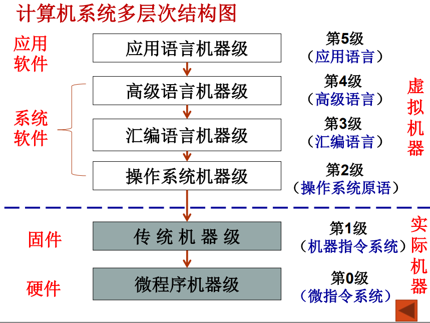

# CH1 计算机系统结构导论

翻译：先用转换程序将高一级机器级上的程序整个地变换成低一级机器级上等效的程序，然后再在低一级机器级上实现的技术。

解释：在低级机器级上用它的一串语句或指令来仿真高级机器级上的一条语句或指令的功能，是通过对高级的机器级语言程序中的每条语句或指令逐条解释来实现的技术。

**计算机系统结构、计算机组成、计算机实现所包含的内容（选择）；**
- 计算机系统结构包含：
	- 数据表示
		硬件能直接识别和处理的数据类型、格式
	- 寻址方式
		最小寻址单位，寻址方式的种类，地址的计算
	- 寄存器组织
		数据寄存器、变址、控制寄存器、专用寄存器等数量，使用方法
	- 指令系统
		指令的格式、类型，使用方法
	- 存储系统
		最小编址单位，编址方式，存储容量，最大存储空间
	- 中断系统
		中断类型，优先级别，入口地址的形成
	- I/O 接口的结构
		I/O 的连接方式、访问方式、编址方式
	- 信息的保护
		保护方式，硬件对信息的保护和支持
	- 机器工作状态、定义和切换
- 计算机组成包含：
	- 数据通路宽度
	- 专用部件的设置
	- 各种操作对部件的共享程度
	- 功能部件的并行度
	- 控制机构的组成方式
	- 缓冲和排队技术
	- 可靠性技术
- 计算机实现包含：
	- 处理机、主存、I/O 接口等部件的物理结构
	- 器件的集成度和速度的选择
	- 器件、模块、插件、底板的划分与连接
	- 专用器件的设计
	- 组装技术
	- 信号传输
	- 电源、冷却、整机的装配等

**计算机系统设计思路（填空、选择）；**

**系列机和兼容机的概念（选择、填空）；**
- 系列机：同一厂家生产的具有相同计算机结构，但具有不同组成和实现的一系列不同档次不同型号的机器；
- 兼容机：不同厂家生产的具有相同计算机结构的计算机。

**计算机系统设计步骤（选择、填空）；**

**计算机的层次结构（选择）；**

**计算机系统结构的定义（实质）（选择）；**
- 系统结构就是要研究对于某级，哪些属性应该透明，哪些属性不应该透明。更本质地说，系统结构就是某一语言程序员在对应的机器级上能够编写正确运行的程序所必须了解的所有计算机属性的集合。
- 计算机系统结构的实质是完成硬件、软件的功能分配, 对计算机的机器级界面的确定。
	- 界面之上，是软件实现的功能；界面之下是硬件和固件实现的功能。

**计算机系统结构、计算机组成、计算机实现三者之间的区别和联系（简答、选择）；**
- 计算机系统结构----系统设计
	计算机组成----逻辑设计
	计算机实现----物理设计
- 相同系统结构的计算机可以采用不同的组成；相同组成的计算机可以采用不同的实现技术。
- 组成设计向上决定于结构，向下受限于实现技术
	- 结构不同，采用的组成技术不同；
	- 组成技术的进步推动结构的发展；
	- 实现技术的发展使得三者的关系更加紧密

软、硬件取舍原则（简答、选择）；

解决软件可移植性的方法（选择、填空）；

透明性的定义和判断（选择）；

CPU 性能公式；

Amdahl 定律（计算）；

三大定量分析原理（填空、简答）；

并行性的概念和分类（简答、选择、填空）；

Flynn 分类（选择、填空）；

系统结构中开发并行性的途径（填空、选择、简答）

耦合度（填空、选择）
