# CH3 标量处理机

**重叠和顺序解释的异同（简答、选择）；**
- 顺序解释
  - 各条机器指令之间顺序串行地执行，执行完一条指令后采取出下条指令来执行，而且每条指令内部的各个微操作也是顺序串行地执行。
  - 特点
    - 控制简单
    - 速度慢、各部件利用率低
- 重叠解释
  - 在解释第k条指令的操作完成之前，就可开始解释第k+1条指令
- 相同：每一条指令的实现速度相同
- 不同：重叠解释能加快相邻两条以至一段程序的解释
  
**重叠和流水概念及工作原理（选择）；**
- 流水的概念：流水是重叠的引申，在一个任务完成以前就可以开始一个新的任务。
  - 将指令分成更多的子过程，可同时解释多条指令，是多条指令的重叠处理，是更高程度的重叠。

**一次重叠、二次重叠的概念（选择）；**
- 一次重叠：在任何时刻，指令分析部件和指令执行部件止只有相邻两条指令在重叠解释的方式。
- 二次重叠：同时解释3条指令 

**重叠对组成的要求（简答、选择）；**
- 解决可能存在的访存冲突
  - 原因：一般的机器上，操作数和指令混存于同一主存内，取指需要访主存，分析中取操作数也可能访主存。而一次只能访问一个主存单元。
  - 解决方法：
    - 操作数和指令分存于两个独立编址且可同时访问的存储器
    - 采用多体交叉主存结构
    - 增设指令缓冲寄存器（如果每次都可以从指缓中取得指令，则“取指k+1”的时间很短，就可把这个微操作合并到“分析k+1”内，则可将原先的重叠变成只是“分析k+1”与“执行k”的重叠）
  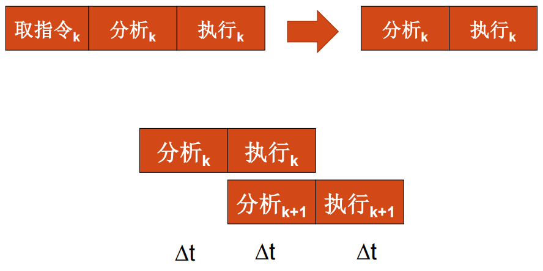
- 在硬件上保证有独立的指令分析部件和指令执行部件；
  - 处理机需要有独立的取指令部件、分析指令部件、执行指令部件。
- 解决控制的同步
  - 保证任何时候只是“分析k+1”与“执行k”的重叠
- 转移指令的处理问题
  - 原因：条件转移成功时，重叠实际变成了顺序
  - 解决方法：
    - 采用重叠方式的机器中，应尽量减少使用条件转移语句。
    - 若出现条件转移语句，可使用延迟转移技术等（如将第k条转移指令与条件转移无关的第k-1条指令交换位置）
  
**重叠相关的两种解决方案并就其原因用系统设计原理作出解释（选择、填空、简答）；**
 - 原因： 因为机器语言程序中临近指令之间出现了关联，为防止出错让它们不能同时解释的现象就称为发生了“相关”。（如：当后继指令的操作数刚好是前一指令的运算结果）
  - 指令相关：后一指令的内容受前一指令的执行结果影响而产生的关联
    - 处理：
      - 程序运行过程中不允许修改指令；
      - 设置一条“执行”指令，将指令相关转化成操作数相关来解决
  - 操作数相关：两条指令的数据有了关联
    - 主存空间数相关：相邻两条指令之间出现对主存同一单元要求先写入后读出的关联。
      - 处理：推后读（具体方法：由存控给读数、写数申请安排不同的访存优先级来解决，只要将写数级别安排成高于读数级别，则自动实现了推后读）
    - 通用寄存器空间数相关：当程序执行过程中出现L1（k+1）=L3（k）时就发生了L1相关；而当L2（k+1）=L3（k）时就发生了L2相关。
    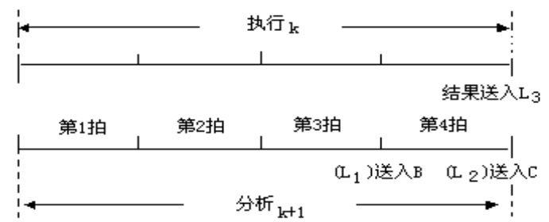
        - 处理：
          - 推后读（推后到“执行k”结束或推后到“执行k”把结果送入L3）（牺牲速度来避免相关出错）
          - 增设相关专用通路（以增加设备为代价，重叠效率不下降）（仅用于通用寄存器空间数相关 因为主存空间数相关的出现概率低）

**几种相关的判断及解决方法（选择、填空）；** 同上

**流水线分类（选择、填空）**
- 根据向下扩展和向上扩展分类
  - 向下扩展：把子过程进一步细分
  - 向上扩展：在多个处理机之间进行流水
- 按流水处理的级别不同
  - 部件级流水：构成部件内的各个子部件之间的流水，如运算器内浮点加法流水线。
  - 处理机级流水：指构成处理机的各个部件的流水，如“取指”、“分析”、“执行”间的流水。
  - 系统级流水：构成计算机系统的多个处理机之间的流水，也称为宏流水。
- 按功能分类
  - 单功能流水线：只能完成一种固定功能。
  - 多功能流水线：流水线的各段通过不同的连接实现不同的功能 
- 按工作方式分类
  - 静态流水线
  - 动态流水线
  - 动态流水线必是多功能流水线，单功能流水线必是静态的
- 按所具有的数据表示分类
  - 标量流水处理机：没有向量数据表示
  - 向量流水处理机：具有向量数据表示
- 按所各段之间是否有反馈回路分类
  -  线性流水线：各段只流过一次，没有反馈回路
  -  非线性流水线：某些功能段有反馈回路，可能多次经过某个段

**流水线特点（选择）；**
- 一条流水线由多个流水段组成(多段)
- 每个流水段有专门的功能部件对指令进行某种加工(专件)
- 流水线工作阶段可分为建立、满载和排空三个阶段(三阶段)
- 在理想情况下，当流水线充满后，每隔Δt时间将会有一个结果流出流水线。
- 流水技术适用于大量重复程序过程。只有不断提供输入，才能连续流水输出，机器效率才能充分发挥。

**解决影响流水线瓶颈的方法（选择、填空）；**
- 最大吞吐率取决于最慢子过程所需时间。最慢子过程称为“瓶颈”子过程
- 消除方法：
  - 将瓶颈子过程再细分
  - 瓶颈子过程重复设置（资源重复）
  

**流水线性能分析（会画时空图及计算）；**
- 吞吐率：流水线单位时间内流出的任务数或结果数 （任务数/总时间）
  - 最大吞吐率：流水线正常满负荷工作时，单位时间内流出的最大结果数
  - 实际吞吐率：从启动流水线开始到流水线操作结束，单位时间内能流出的任务数或结果数
  - 实际吞吐率总是低于最大吞吐率（有建立阶段和排空阶段）
  - $T_{p}=n/T_{k}$
- 加速比：流水线工作相对于顺序串行工作方式，速度提高的比值（串行时间/总时间）
  - 各功能段时间相等：$S_{p}=n\times k/(k+n-1)$
  - 各功能段时间不相等：$S_{p}=n\times \sum_{i=1}^{k} Δt_{i}/(\sum_{i=1}^{k} Δt_{i}+(n-1)Δt_{max})$
- 效率：在整个运行时间里，有多少时间流水线设备真正用于工作。是实际使用时间占整个运行时间之比（n个任务的时空区面积/k个段的总时空面积）
  - 如果是k段线性流水线，且各段经过时间相同，则在T时间里，流水线各段的效率都相同
  
  - 整个流水线的效率：
  - 
  - 对于线性流水且每段经过时间相等时，流水线的效率正比于吞吐率
  - 
  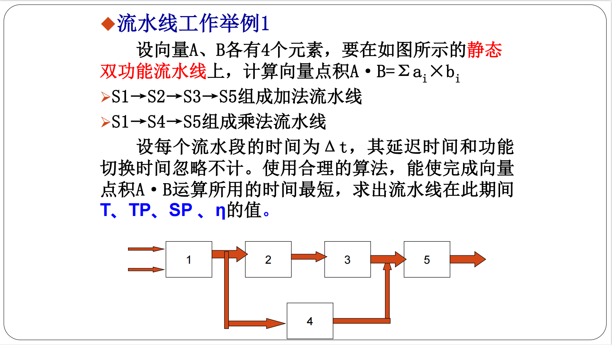
  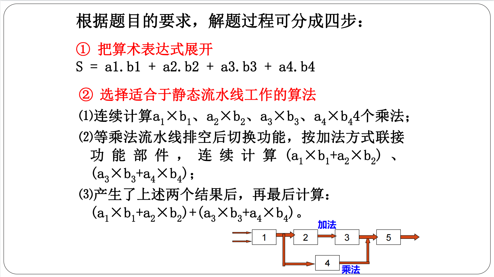
   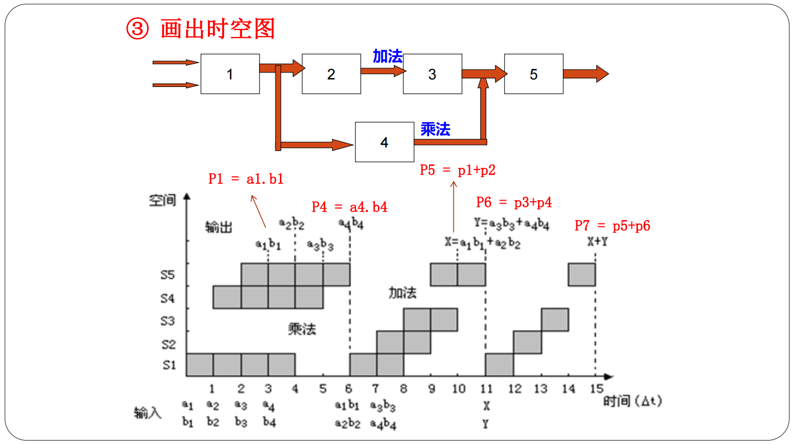
  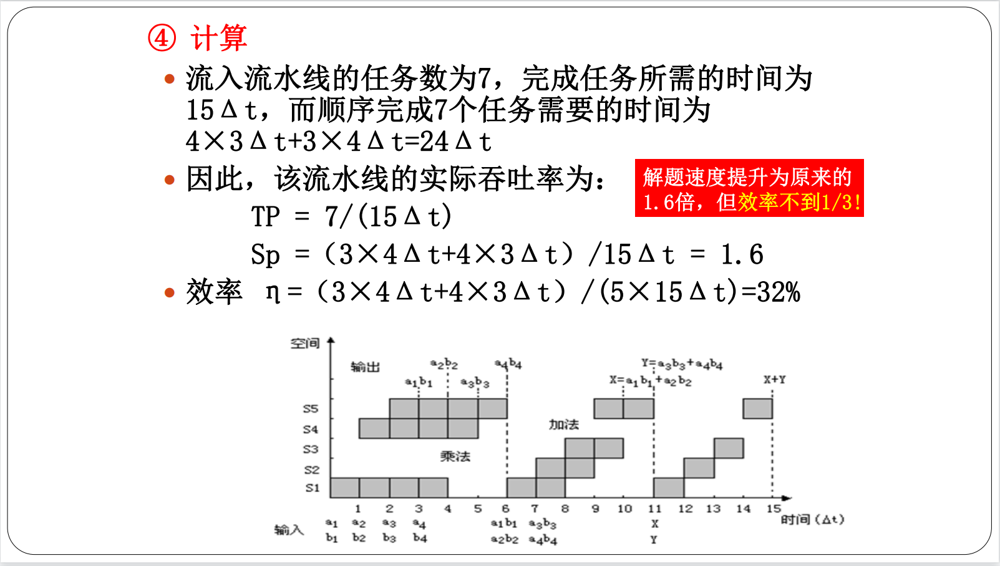
**流水线的相关处理（选择、填空）**
- 局部性相关（数据相关）：指令相关、主存数相关和寄存器组数相关
  - 处理：
    - 推后对相关单元的读
      - 问题：吞吐率、效率低
    - 设置相关专用通路
  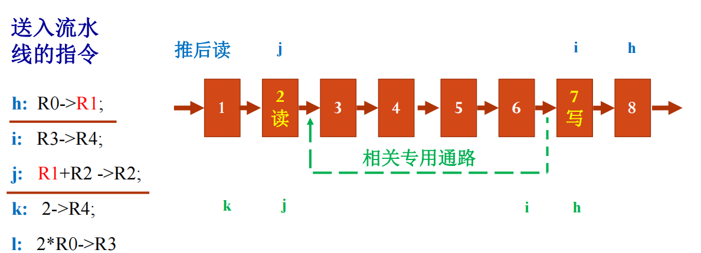
- 全局性相关（转移相关）：转移指令引起流水线中已被解释的指令作废
  - 处理：
    - 猜测法（分支预测技术）
      - 猜测原则：猜概率高者，两者概率相近时，宜选不成功转移分支，因为它已预取进指缓
      - 保证在猜错时可恢复现场
        - 恢复方法：
          - 对猜测指令的解释只完成译码和准备好操作数，在转移条件码出现前不执行运算；
          - 对猜测指令的解释可完成到运算完毕，但不送回运算结果；
          - 对猜测指令不加区别地全部解释完，但需把可能被破坏的原始状态都用后援寄存器保存起来
    - 加快和提前形成条件码：加快单条指令内部条件码的形成，在一段程序内提前形成条件码
    - 延迟转移技术：用软件方法将转移指令与其前面不相关的指令交换位置
    - 加快短循环程序的处理：将长度小于指缓的循环程序一次性放入指缓，并暂停预取指令或循环出口端的条件转移指令恒猜循环分支。

**异步流动流水线和同步流水线及可能出现的相关（选择、填空）；**
- 顺序/同步流动方式：任务流出流水线的顺序与流入顺序一致。
  - 实质：推后读
- 异步流动方式：任务流出流水线的顺序与流入顺序不同。
- 可能出现的新相关：
  - “写-写”相关：如：i，k指令都要写入同一单元，避免最终出现k先写入而i后写入
  - “先读后写”相关：如：避免最终出现l的读操作落后于m的写操作。
- sum:采用总线式分布式控制管理，进一步优化处理标量流水处理机的局部相关问题
 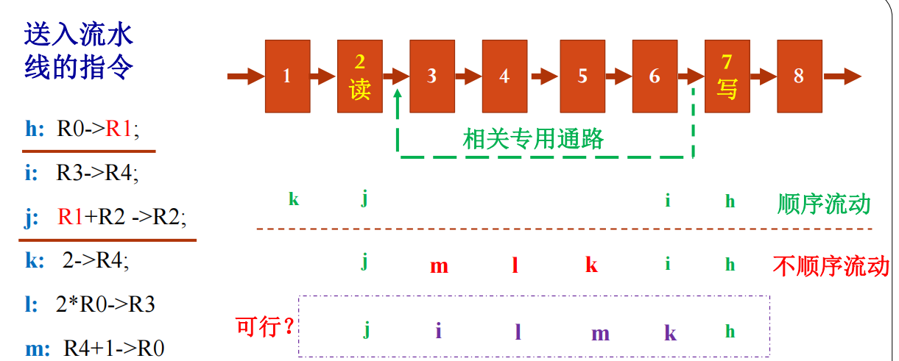
**单功能非线性流水线的调度（简答）**
- 启动距离：向一条流水线的输入端连续输入两个任务之间的时间间隔。
- 冲突：当以某一个启动距离向一条非线性流水线连续输入任务时，可能在某一个功能段，或某几个功能段中发生有几个任务同时争用同一个功能段的情况
- 主要目标：找出具有最小平均启动距离的启动循环（即最小的循环周期）
- 预约表
  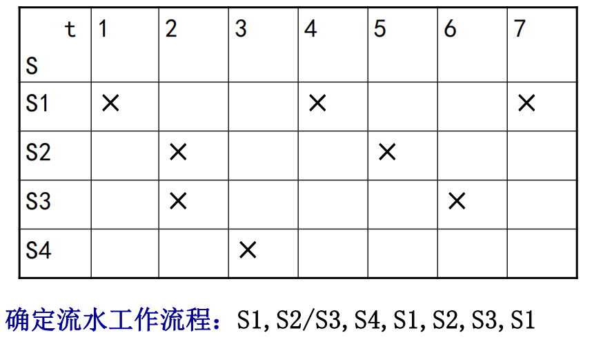
- 禁止启动距离：引起非线性流水线功能段冲突的启动距离
- 无冲突调度方法
  - 根据预约表写出延迟禁止表F(预约表中所有同一行中任意两个“X”间的距离)
  - 由延迟禁止表形成冲突向量C（冲突向量长度等于禁止向量中的最大值，由高到低）
  - 由所有的向量图画出状态图（注意所有状态经过m*均可到达初始状态，m为禁止向量最大值）
  - 由状态图形成最佳调度方案（所有闭合回路均为调度周期策略，找出其中平均启动距离最小的）
  
  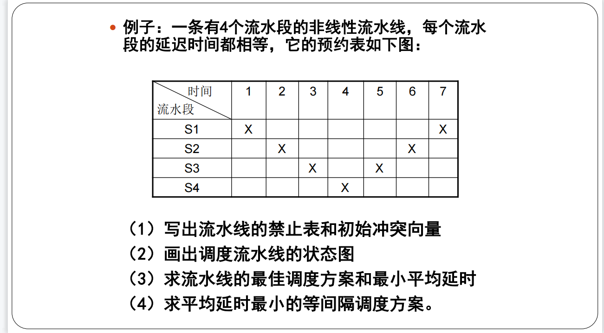
  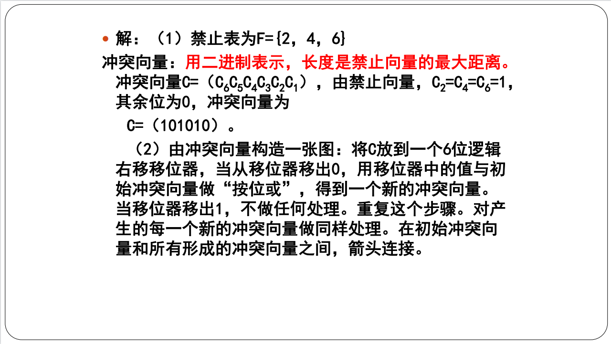
  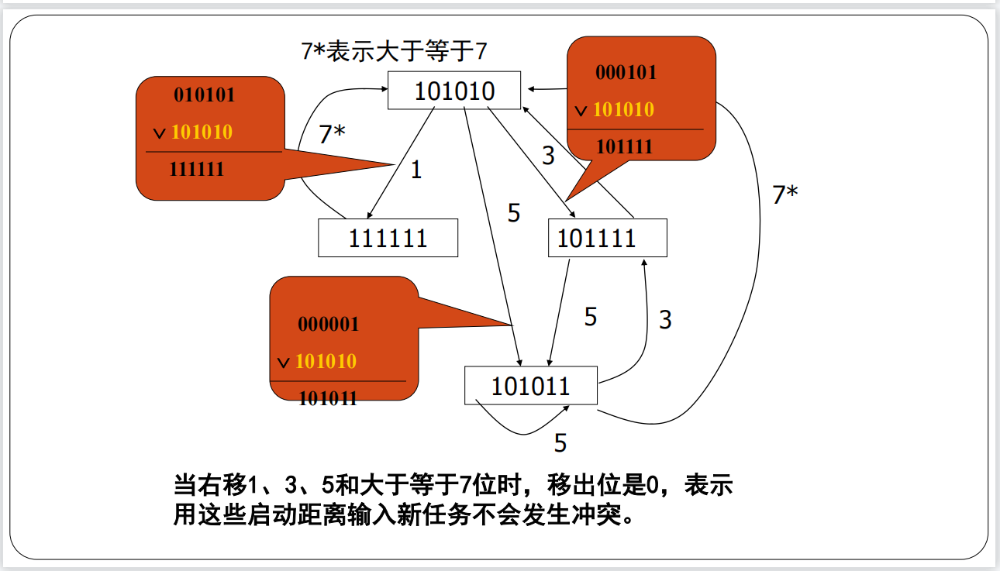
  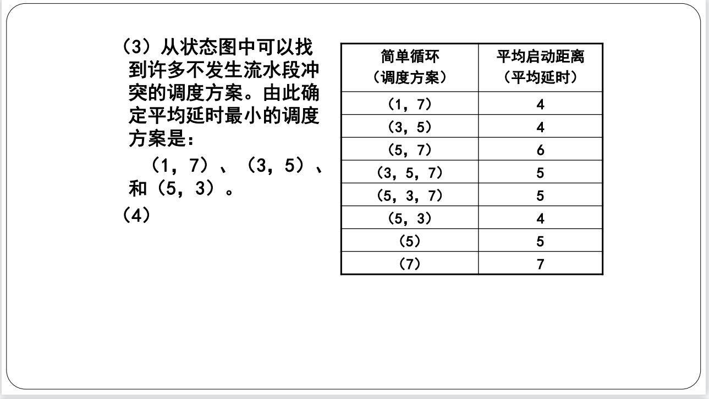
  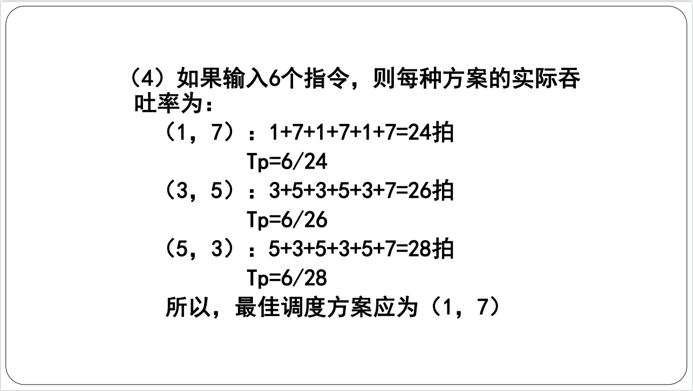
  
  