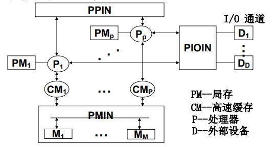
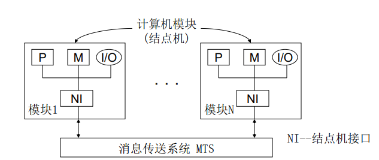
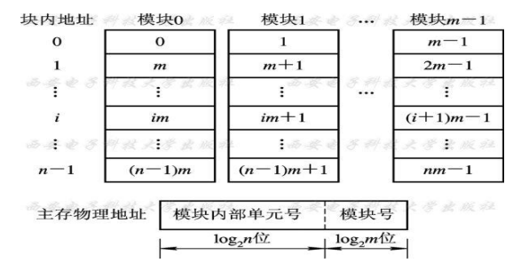
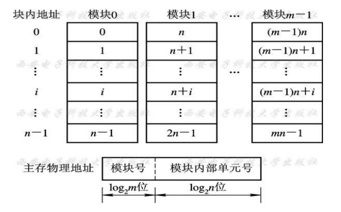
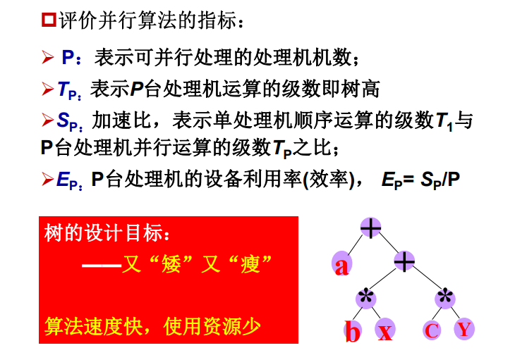
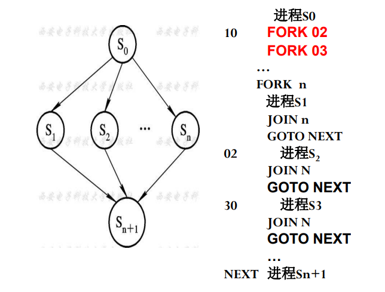
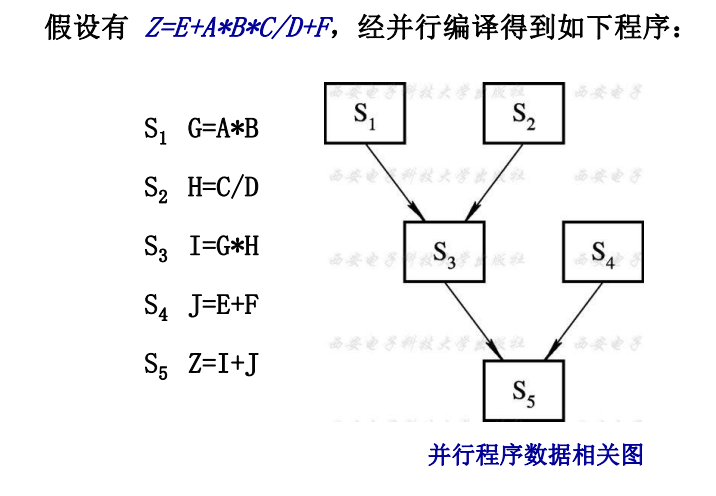
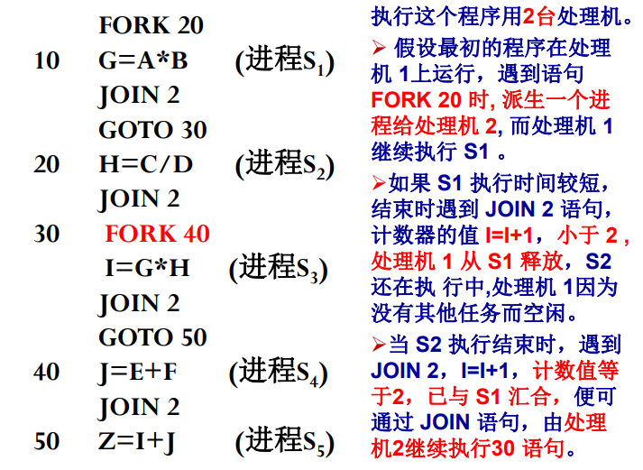

# CH5 多处理机

**多处理机耦合度（填空）；**
- 紧耦合多处理机
	- 
	- 特点：通过共享主存实现机间通讯。
	- 互连网络：实现PE←→PEM、PE←→I/O通道、PE←→中断信号间的连接。
	- 系统属性：
		- 同构/异构--PE类型相同/不同；
		- 对称/非对称--每个PE与部分/全部的I/O通道连接。
	- 常见结构：同构对称式和异构非对称式多机系统。
	- 限制：PE数量不能很多。为什么？
		- 主存带宽、IN带宽、同步开销限制了PE的数量。
	- 访存冲突解决方案：
		- 采取多体交叉访问方式，增加PEM数量；
		- 每个PE自带小容量局部存储器，存放核心代码、OS 表格等，减少 PE 访存次数；
		- 每个 PE 自带一个 Cache，减少 PE 访存次数。
- 松耦合多处理机
	- 
	- 每台处理机都有一个容量较大的局部存储器；不同处理机间可通过通道互连或 MTS 实现通信。
	- 松耦合多处理机较适合做粗粒度的并行计算。作业可被分为若干个相对独立的任务，任务间信息流量较少，则可在多个处理机上并行执行，即松耦合度的多处理机系统有效。
	- 特点：通过消息传送系统实现机间通讯；每个模块是一个独立的处理机，整个系统可看成是一个分布系统。
	- 互连网络：MTS有总线、环形、多级网络等种类；
	- 结构：有层次和非层次两种结构

**多处理机定义以及硬件结构；（硬件结构没找到）**
- 定义：多处理机系统机是指有两台以上的处理机，共享 I/O 子系统，机间经共享主存或高速通信网络通信，在操作系统控制下，协同求解大而复杂问题的计算机系统。
	- 作业、任务级并行的 MIMD 计算机，采用资源共享途径实现并行
- 硬件结构：
	- 紧耦合与松耦合
	- 机间互连形式
		- 总线形式
		- 环形互连形式
		- 交叉开关形式
	- 存储器的组织
		- 低位交叉
		- 高位交叉

**机间互连形式及采用算法（选择、填空）；**
- 总线形式 （时间分配）
	- PE、PEM、I/O通道均连在总线上，采用分时或多路转换技术实现数据传递，是最简单的连接方式。
	- 总线仲裁算法：静态优先级算法、平等算法、动态优先级算法、先来先服务算法等。
	- 对外设一般采用优先级算法；对PE采用均等算法。
	- 实现方法：
		- 集中式：由总线控制器控制；
		- 分布式：中机构分散到各PE中。
	- 提高总线效率方法：改善传输介质和增加总线数量。
	- 总线互连方式不适宜连接过多的处理机。
- 环形互连形式
	- 为保持总线式互连的优点，同时又能克服其不足，可以考虑构造一种逻辑总线，让各台处理机之间点点相连成环状，称环形互连，
- 交叉开关形式 （空间分配）
	- 是总线形式的极端，总线数=PE数+PEM数+I/O通道数，是一种全相联形式，控制、仲裁、转换机构均在开关中。
	- 改进：用一系列较小开关串联或并联，形成多级交叉开关，减少其复杂性。交叉开关方式不适宜连接过多的处理机。
- 多端口存储器形式
	- 将控制、仲裁、转换机构移到存储器中。
	- 每个端口与一个PE或I/O通道相连。
	- 多端口存储器形式不适宜连接过多的处理机

**多处理机的存储器组织中两种编址方式及其适应场合（简答、选择）；**
- 由 m 个存储器模块构成的并行存储器，存储单元的地址是按交叉方式编址的。这种地址交叉编址的方式主要有低位交叉和高位交叉两种。
	- 低位交叉编址：块内顺序物理地址不连续，距离为 m。（即低位不变）
		- 
		- 低位交叉编址方式下，连续物理地址空间的数据被分散到各个分存储体中；
		- 适用于当前执行的多个进程基本共享数据的情况，空间中的数据，如流水线、向量或阵列处理机
	- 高位交叉编址：块内顺序物理地址连续，总体也依次连续分布（即高位不变）
		- 
		- 适用于当前执行进程是不共享同一集中连续物理地址，可将存储模块中的一定数量的页面分配给某进程
		- 将放置处理机 i 执行进程要用到的绝大多数页面的那个存储器模块 i 称为是处理机 i 的本地存储器

**多处理机的 cache 一致性问题（选择、填空）；**
- 共享可写数据引起不一致性
- 进程迁移引起数据不一致性
- I/O 传输造成的数据不一致性
- 如果一个存储器满足以下 3 点，则称该存储器是一致的。
	- 处理器 P 对单元 X 进行一次写之后又对单元 X 进行读，读和写之间没有其他处理器对单元 X 进行写，则 P 读到的值总是前面写进去的值。
	- 处理器 P 对单元 X 进行写之后，另一处理器 Q 对单元 X 进行读，读和写之间没有其他写，则 Q 读到的值应该是 P 写进去的值。
	- 对同一单元的写是顺序化的，即任意两个处理器对同一单元的两次写，从各个处理器的角度看顺序都是相同的。
- 解决的方法
	- 解决进程迁移引起的 Cache 不一致性
		- 禁止迁移
		- 触发写回主存
			- 进程挂起时，将该进程改写过的块写回主存
	- 以硬件为基础实现多 Cache 一致性（关键：跟踪记录共享数据块的状态）
		- 监视/监听法（Snoopying）
			- 适用结构：总线型互连的多处理机
			- 基本思想：利用总线播送更改主存的情况，各个Cache控制器通过监听总线来判断它们是否有总线上请求的数据块。
			- 实现方式：
				- 写作废协议
					- 当一个处理器第一次对某数据项进行写入时，通过广播使其他Cache中所有对应该数据项的副本作废。
				- 写更新协议
					- 当一个处理器对某数据项进行写入时，通过广播使其他Cache中所有对应于该数据项的副本进行更新。
		- 目录表法（Directory）
			- 目录：一种专用的数据结构，用于记录可以进入 Cache 的每个数据块的状态、哪些处理器有该块的副本以及是否修改过等信息。
			- 适用结构：非总线型互连的多处理机
			- 基本思想：根据目录表，一个处理机在写入自身 Cache 的同时，只需有选择地通知其他存有此数据块的 Cache 将副本作废或更新。
				- 全映像目录表
				- 有限目录表法
				- 链式目录表法
	- 以软件为基础实现多 Cache 一致性
		- 基本思想：不允许要共享的可写数据进入 Cache
			- 任意时刻均不允许共享的可写数据进入 Cache，只留在主存中
			- 通过编译分析后，只在实际有写入操作会影响一致性的时间内不允许进入主存

**表达式的树形流程图（会画图并计算）；**
- 

**程序并行性分析（选择、填空）；**
- 多处理机系统中，程序段并行必然是“异步流动”。
- 数据相关
	- 如果Pi的左部变量在Pj的右部变量集内，且 Pj 必须取出 Pi 运算的结果来作为操作数，就称 Pj “数据相关”于 Pi。
	- 如：Pi:A=B+D, Pj:C=A\*E
	- 当 Pi 和 Pj 服从交换律时，虽不能并行执行，但可以交换串行 Pi：A=2\*A，Pj:A=3\*A
	- 相当于流水线中发生的“先写后读”相关
- 数据反相关
	- 如果Pj的左部变量在Pi的右部变量集内，且当Pi未取用其变量的值之前，是不允被Pj所改变的，就称Pi“数据反相关”于Pj 。
	- 如：Pi:C=A+E, Pj:A=B+D
	- 相当于流水线中发生的“先读后写”相关
- 数据输出相关
	- 如果Pi的左部变量也是Pj的左部变量，且Pj存入其算得的值必须在Pi存入之后，则称Pj“数据输出相关”于Pi。
	- 如 Pi:A=B+D, Pj:A=C+E
	- 相当于流水线中发生的“写-写”相关
- 其他相关
	- 若两个程序段的输入变量互为输出变量，同时具有“先写后读”和“先读后写”两种相关，以交换数据为目的，则两者必须并行执行，既不能顺序串行， 也不能交换串行。
	- 如：Pi: A=B, Pj: B=A
	- 并行执行，且必须保证读、写完全同步。

多处理机 相较于 阵列处理机
- 并行性级别：作业、任务级，更高
- 硬件结构 ：多个处理器要用多个指令部件控制
- 算法实现 ：进一步挖掘更多隐含的并行性
- 系统管理 ：更多依靠操作系统等软件手段

**FORK、JOIN 语句（选择）；**
- Fork m
	- 派生：在一个任务执行的同时，产生出一个或多个与它并行的任务，分配给不同的、正在等待的处理机完成。
- Join N
	- 汇合：把分散在各处理机执行的任务，全部完成后，再汇合起来，进入后续任务。

**多处理机上并行执行的程序及时间资源图（设计程序并画图）；**
- 
- 
- 
- GOTO 在时间资源图上一定要有表示！！！

**多处理机的操作系统分类（选择、填空）；**
- 主从型操作系统
	- 有一台主处理机上运行操作系统，其他的处理机为从处理机，由主处理机管理从处理机的进程和分配任务。
	- 一台从处理机在执行进程的过程中需要得到管理程序提供服务时，必须向主处理机发生申请，等待主处理机响应后对它提供服务。
- 各自独立型操作系统
	- 每台处理机都有一个独立的管理程序（操作系统的内核）在运行，即每个处理机都有一个内核的副本，执行各种管理功能。
- 浮动管理控制方式
	- 浮动型操作系统是界于主从型和单独型之间的一种折衷方式，其管理程序可以在处理机之间浮动。担任“主控制处理机” 的设备不固定、担任的时间不固定。
